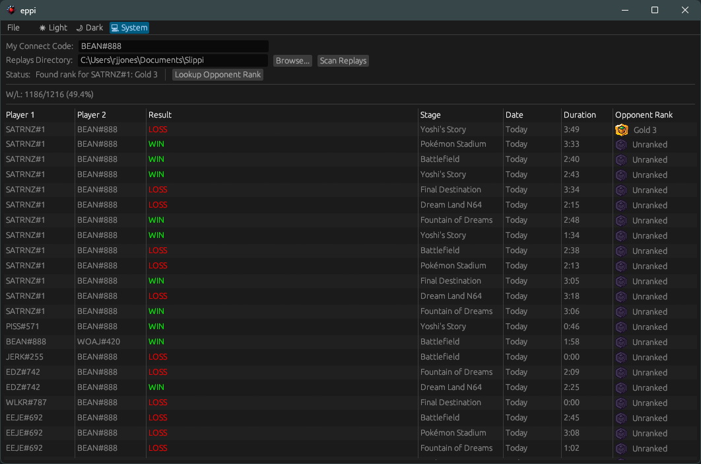

# Eppi

**Eppi** is a lightning-fast, cross-platform GUI for browsing, filtering and analysing [Project Slippi](https://slippi.gg/) replay files (`.slp`).
It provides an alternative to the [Slippi Launcher](https://github.com/project-slippi/slippi-launcher) aiming for speed and a snappy user-experience.



## Features

* ⚡ **Ultra-fast scanning** – parses tens of thousands of replays in seconds.
* 📊 **Rich table view** – sortable, resizable columns with player tags, stage, result, date & duration.
* 🏆 **Rank integration** – ability to pull opponents rank.
* 📈 **Win/Loss statistics** – instant W/L and win-rate breakdown for your Connect Code.
* 🔍 **Directory watcher** – planned feature for live reload when new replays are added.
* 🖥️ **Cross-platform desktop** – runs natively on Windows/Linux/macOS.
* 🦀 **Written in Rust** – powered by `eframe`/`egui`, Tokio and a tiny memory footprint.

## Usage

1. **Enter your Connect Code** in the text box (e.g. `ABCD#123`).
2. **Select a replay directory** or paste the path manually.
3. Click **"Scan Replays"** – Eppi indexes the folder and shows the results.
4. (Optional) Hit **"Lookup Opponent Rank"** to fetch the rank badge for your most-recent rival.

Rows are resizable, double-click a header edge to auto-size. Use the horizontal scroll bar to reveal hidden columns.

## Comparison with [Slippi Launcher](https://github.com/project-slippi/slippi-launcher)

Eppi focuses on fast replay analysis and aims to keep binary size and startup times minimal.

|                              | Eppi | Slippi Launcher |
|------------------------------|:----:|:---------------:|
| Replay scanning speed        | 🟢 Fast | 🟡 Moderate |
| File browser & launching     | 🟡 Planned | 🟢 Yes |
| Netplay integration          | 🟡 Planned | 🟢 Yes |
| Rank lookup                  | 🟢 Yes | 🔴 No |
| Cross-platform               | 🟢 Yes | 🟢 Yes |


## Roadmap

### 0.2.0

- Add a "Fetch Rank" button in each row for missing ranks
- Remove the global "Lookup Opponent Rank" button

### 0.3.0

- Cache scan results so subsequent rescans skip already-analysed replays

### 0.4.0

- Introduce a filter bar
  - Hide short games
  - Hide unranked games
  - Hide CPU matches
  - Hide team matches
  - Filter by selected rank
  - Filter by selected stage

### 0.5.0

- Enable sortable columns (sort preferences should persist)

### 0.6.0

- Ensure the table correctly fits the window on startup

### 0.7.0

- Add a Settings screen
  - Choose to show Netplay name, Connect Code, or both in player columns
  - Choose to display rank as text, icon, or both
  - Choose to display time as natural language, exact date, or both
  - Select which columns are visible
  - Show path to settings location with a button to reset/clear all app data
  - Move the light/dark/system theme selector into Settings (remove the File menu)

### 0.8.0

- Add a search bar that searches by Netplay name or Connect Code

### 0.9.0

- Add Dolphin launching functionality

## License

Eppi is dual-licensed under **Apache-2.0** and **MIT** for maximum compatibility. See `LICENSE-APACHE` and `LICENSE-MIT` for full text.

## Data location

All cached data and settings are stored in your OS-specific data directory:

**Windows:**
```
C:\Users\<username>\AppData\Local\eppi
```

**macOS:**
```
/Users/<username>/Library/Application Support/eppi
```

**Linux:**
```
/home/<username>/.local/share/eppi
```

You can safely delete this folder to reset the application state.
